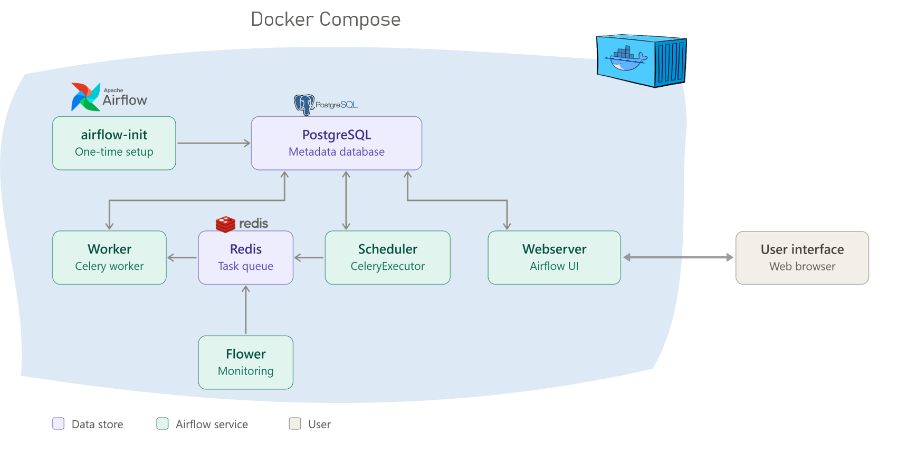
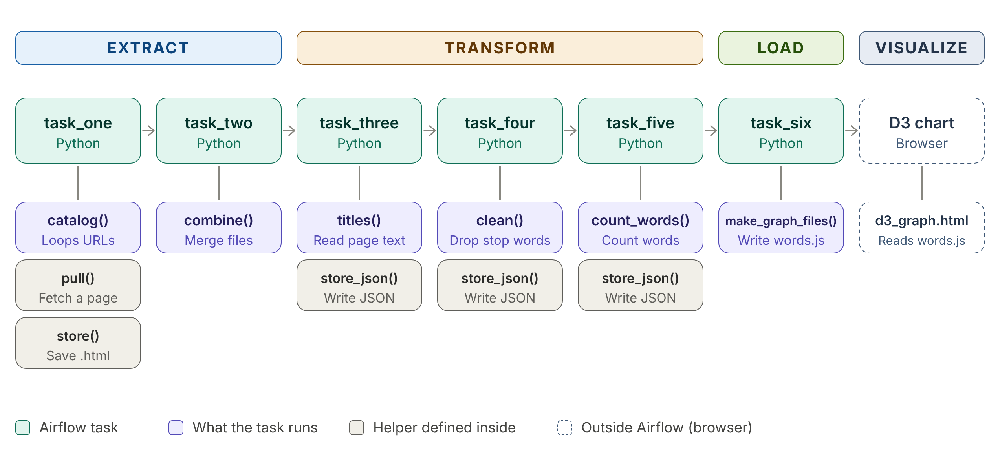

# Words Frequency using Airflow 
Apache Airflow is an open-source platform for authoring, scheduling, and monitoring workflows, mostly used for data pipelines. At the core of Airflow is the DAG (directed acyclic graph), a set of tasks with defined dependencies between them.

In this project, Airflow orchestrates a pipeline that extracts web pages as HTML, processes the raw content, and produces a final word frequency analysis. The workflow is defined as a DAG named "word_frequency_pipeline" that runs once a day. 

Each stage is a separate task that starts only after the previous one has finished successfully: the DAG scrapes a set of web pages, extracts the headings, cleans them, and produce a final word frequency analysis.

## Architecture components


Above high architecture components will explain the connection between airflow components and below is description of each: 

- **Airflow-init**
    
    runs once, the first time the Docker Compose stack starts. It initializes (migrates) the Airflow metadata database, which is PostgreSQL in this setup, and creates the default admin user.
    
- **PostgreSQL**
    
    the metadata database for Airflow. It stores task history, DAG runs, connections, Variables, and cross-communication records. In this setup it also serves as the Celery result backend.
    
- **Scheduler**
    
    triggers scheduled workflows and submits tasks to the executor to run.
    
- **Executor**
    
    this project uses the CeleryExecutor. The executor is not a separate container; it is a configuration property of the scheduler and runs inside the scheduler process. The CeleryExecutor sends tasks to a queue so they can be distributed across multiple workers, which makes it one of the ways to scale out Airflow.
    
- **Redis**
    
    an in-memory key-value store used as the Celery message broker. Airflow uses it for transient Celery messages such as queued task commands, task acknowledgements, and other broker-side state.
    
- **Worker**
    
     a Celery worker that picks up tasks from the Redis queue and executes them.
    
- **Celery Flower**
    
    a web UI built on top of Celery for monitoring the workers.
    
- **Webserver**
    
    serves the Airflow UI, which in this setup runs locally at http://localhost:8080.

In conclusion, the whole environment runs in Docker. The scheduler decides which task is ready to run, Redis passes that task to a worker, and PostgreSQL records the state of every run. As a result, the entire process, from collecting raw web pages to producing the word frequency result, runs automatically each day without manual steps. Because the tasks are chained in order, Airflow handles scheduling, retries, and monitoring for the whole pipeline.

Below is a visual description of the tasks, showing how each one fits into the ETL pipeline.



### Prerequisites

#### Software

- **Docker Desktop** (Windows), with Docker Compose v2. Compose v2 is used through the `docker compose` command.
- **A web browser** to use the Airflow UI with port 8080 available or make sure to adjust it if not available.
- **An internet connection**, for three things: pulling the Docker images, downloading the web pages in `00_urls.txt`, and loading D3 v3 from `d3js.org` in the chart page.
- **A terminal**, such as PowerShell.

#### System resources

- Enough free disk space for the images. The custom Airflow image is about 884 MB, and PostgreSQL and Redis add more.
- Enough memory allocated to Docker Desktop. The Airflow Docker guide recommends at least about 4 GB (**check** the current guide).

#### Used Python and libraries Versions

- **Python 3.6**, the version inside the Airflow 2.1.1 image. Code written for the DAG must work on 3.6.
- **beautifulsoup4 4.12.3**, installed in the `Dockerfile` with `pip install beautifulsoup4==4.12.3`. This is the only extra library.
- **Python standard library modules** (no install needed): `urllib`, `os`, `re`, `glob`, `json`, `time`, `hashlib`, `collections`.

### To Start 

Got to your command prompt make sure you are in the file called Airflow-docker and run 
```
 docker compose up -d 

```
